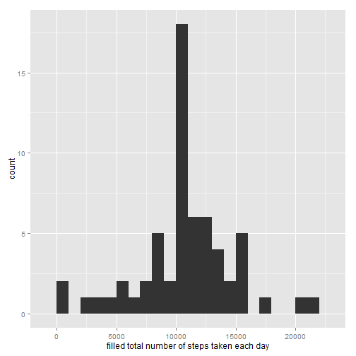

# Reproducible Research: Peer Assessment 1

## Loading the data

```r
data <- read.csv("activity.csv")
```
 
## Plot steps taken each day and calculate mean and median

```r
library(ggplot2)
total.steps <- tapply(data$steps, data$date, FUN=sum, na.rm=TRUE)
qplot(total.steps, binwidth=1000, xlab="total number of steps taken each day")
```

 

```r
mean(total.steps, na.rm=TRUE)
```

```
## [1] 9354.23
```

```r
median(total.steps, na.rm=TRUE)
```

```
## [1] 10395
```

## Plot average number of steps taken and which 5 min interval has the max
## average steps


```r
library(ggplot2)
averages <- aggregate(x=list(steps=data$steps), by=list(interval=data$interval),
                      FUN=mean, na.rm=TRUE)
ggplot(data=averages, aes(x=interval, y=steps)) +
        geom_line() +
        xlab("5-minute interval") +
        ylab("average number of steps taken")
```

 

```r
averages[which.max(averages$steps),]
```

```
##     interval    steps
## 104      835 206.1698
```
## Missing data analysis
## Show count of missing values

```r
missingdata <- is.na(data$steps)
table(missingdata)
```

```
## missingdata
## FALSE  TRUE 
## 15264  2304
```
## Replace missing data

```r
fill.average <- function(steps, interval) {
        filled <- NA
        if (!is.na(steps))
                filled <- c(steps)
        else
                filled <- (averages[averages$interval==interval, "steps"])
        return(filled)
}
filled.data <- data
filled.data$steps <- mapply(fill.average, filled.data$steps, filled.data$interval)
```

## Plot steps taken each day after filling and mean/median

```r
total.steps <- tapply(filled.data$steps, filled.data$date, FUN=sum)
qplot(total.steps, binwidth=1000, xlab="filled total number of steps taken each day")
```

 

```r
mean(total.steps)
```

```
## [1] 10766.19
```

```r
median(total.steps)
```

```
## [1] 10766.19
```

mean/median values are higher after filling data because when it was N/A the value was taken as 0 but when the average is filled in then the mean/median becomes higher.

## Differences in activity patterns between weekdays and weekends

```r
wkday.or.wkend <- function(date) {
        day <- weekdays(date)
        if (day %in% c("Monday", "Tuesday", "Wednesday", "Thursday", "Friday"))
                return("weekday")
        else if (day %in% c("Saturday", "Sunday"))
                return("weekend")
        else
                stop("bad date")
}
filled.data$date <- as.Date(filled.data$date)
filled.data$day <- sapply(filled.data$date, FUN=wkday.or.wkend)
```


## panel plot

```r
averages <- aggregate(steps ~ interval + day, data=filled.data, mean)
ggplot(averages, aes(interval, steps)) + geom_line() + facet_grid(day ~ .) +
        xlab("5-minute interval") + ylab("Number of steps")
```

 
